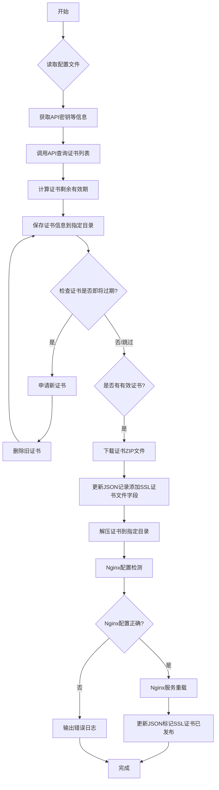

# SSL证书自动管理工具

这是一个用于腾讯云SSL证书自动查询、申请、下载、部署和删除的Shell脚本工具集，适用于需要自动化维护HTTPS证书的Nginx服务器。该工具实现了从证书信息查询到自动续签、部署的完整生命周期管理。

## 功能概述

- **自动查询**：从腾讯云API获取当前账户下所有SSL证书信息
- **过期检测**：计算每个证书剩余有效期，识别即将过期或已过期的证书
- **自动续签**：对即将过期的证书自动申请新证书并删除旧证书
- **证书部署**：下载新证书并解压部署到Nginx配置目录，自动重载服务
- **状态监控**：支持证书状态码到文字描述的自动转换
- **数据持久化**：以JSON格式保存证书详细信息
- **完整日志**：详细的执行日志输出，支持调试模式

## 依赖要求

工具依赖以下命令行工具：
- curl：用于发送API请求
- openssl：用于签名计算
- jq：用于JSON处理
- date：用于日期计算
- iconv：用于字符编码转换

## 配置文件

工具使用`config.ini`配置文件，包含以下配置项：

```ini
[paths]
# 输出目录位置
output_dir=output3
# SSL证书部署目录位置
ssl_dir=/etc/nginx/ssl

[common]
# 腾讯云API密钥信息（必需）
secret_id=YourSecretId
secret_key=YourSecretKey
# API区域（可选）
region=ap-guangzhou
# 临时token（可选）
token=
# 是否开启调试模式：0-关闭，1-开启
debug=0

[certificates]
# 证书ID列表（可选）
# 如果不配置，工具会自动获取账号下所有证书
cert1=YourCertificateId1
cert2=YourCertificateId2
# cert3=YourCertificateId3

[status]
# 证书状态码映射
0=审核中
1=已通过
2=审核失败
3=已过期
4=自动添加DNS记录
5=企业证书，待提交资料
6=订单取消中
7=已取消
8=已提交资料，待上传确认函
9=证书吊销中
10=已吊销
11=重颁发中
12=待上传吊销确认函
13=免费证书待提交资料
14=证书已退款
15=证书迁移中
```

## 使用方式

使用基本语法：
```bash
./ssl_manager.sh [mode]
```

支持的执行模式如下：

| 模式 | 描述 |
|------|------|
| `save` | 默认模式，查询并保存证书信息 |
| `renew` | 对即将过期的证书进行自动申请并删除旧证书 |
| `deploy` | 下载并部署已有证书到Nginx |

## 工作流程

整个SSL证书自动管理工具的工作流程如下所示：



## 脚本结构

工具由多个模块化脚本组成，每个脚本负责特定的功能：

- `utils.sh`: 公共函数与工具方法
- `ssl_list.sh`: 获取证书ID列表
- `ssl_query.sh`: 查询证书详细信息并保存JSON记录
- `ssl_download.sh`: 下载证书并更新记录
- `ssl_nginx.sh`: 部署证书到Nginx
- `ssl_apply.sh`: 自动申请新证书
- `ssl_delete.sh`: 删除旧证书

这种模块化设计提高了代码的可维护性和扩展性。

## 日志输出

- 所有操作均会输出详细的日志信息，便于调试和监控
- 可通过设置 `DEBUG=1` 开启调试模式

```bash
./ssl_manager.sh save
[INFO][2025-06-03 17:54:13] 已启用调试模式，DEBUG值为: 0
[INFO][2025-06-03 17:54:13] 查询并保存SSL证书信息...
[INFO][2025-06-03 17:54:13] 配置文件中未找到证书ID，尝试通过API自动获取...
[INFO][2025-06-03 17:54:13] 通过 API 方式自动获取，找到 3 个证书
[INFO][2025-06-03 17:54:14] ----------------------------------------
[INFO][2025-06-03 17:54:14] 证书ID: OkoRMLEg
[INFO][2025-06-03 17:54:14] 域名: imgs.xxx.com
[INFO][2025-06-03 17:54:14] 状态:  已通过 (代码: 1)
[INFO][2025-06-03 17:54:14] 开始时间: 2025-06-03 08:00:00
[INFO][2025-06-03 17:54:14] 结束时间: 2025-09-01 07:59:59
[INFO][2025-06-03 17:54:14] 剩余有效期: 89天
[INFO][2025-06-03 17:54:14] ----------------------------------------
[INFO][2025-06-03 17:54:15] 证书已成功下载至: output/imgs.xxx.com_nginx.zip
[INFO][2025-06-03 17:54:15] ----------------------------------------
[INFO][2025-06-03 17:54:15] 证书ID: OkoR4fIj
[INFO][2025-06-03 17:54:15] 域名: test.xxx.com
[INFO][2025-06-03 17:54:15] 状态:  已通过 (代码: 1)
[INFO][2025-06-03 17:54:15] 开始时间: 2025-06-03 08:00:00
[INFO][2025-06-03 17:54:15] 结束时间: 2025-09-01 07:59:59
[INFO][2025-06-03 17:54:15] 剩余有效期: 89天
[INFO][2025-06-03 17:54:15] ----------------------------------------
[INFO][2025-06-03 17:54:16] 证书已成功下载至: output/test.xxx.com_nginx.zip
[INFO][2025-06-03 17:54:17] ----------------------------------------
[INFO][2025-06-03 17:54:17] 证书ID: NCWAriDv
[INFO][2025-06-03 17:54:17] 域名: xxx.com
[INFO][2025-06-03 17:54:17] 状态:  已通过 (代码: 1)
[INFO][2025-06-03 17:54:17] 开始时间: 2025-04-04 08:00:00
[INFO][2025-06-03 17:54:17] 结束时间: 2025-07-04 07:59:59
[INFO][2025-06-03 17:54:17] 剩余有效期: 30天
[INFO][2025-06-03 17:54:17] ----------------------------------------
[INFO][2025-06-03 17:54:18] 证书已成功下载至: output/xxx.com_nginx.zip
[INFO][2025-06-03 17:54:18] 所有证书的信息和证书文件都已保存到 output/ 目录中。

 ./ssl_manager.sh deploy
[INFO][2025-06-03 17:54:27] 已启用调试模式，DEBUG值为: 0
[INFO][2025-06-03 17:54:27] 下载与部署SSL证书...
[INFO][2025-06-03 17:54:28] [ssl_nginx] 域名 'xxx.com' 的证书已成功部署至: /etc/pki/nginx/
[INFO][2025-06-03 17:54:28] [ssl_nginx] SSL证书发布成功数据已更新: output/NCWAriDv.json
[INFO][2025-06-03 17:54:28] [ssl_nginx] 已删除证书下载文件: output/xxx.com_nginx.zip
[INFO][2025-06-03 17:54:28] [ssl_nginx] 域名 'test.xxx.com' 的证书已成功部署至: /etc/pki/nginx/
[INFO][2025-06-03 17:54:28] [ssl_nginx] SSL证书发布成功数据已更新: output/OkoR4fIj.json
[INFO][2025-06-03 17:54:28] [ssl_nginx] 已删除证书下载文件: output/test.xxx.com_nginx.zip
[INFO][2025-06-03 17:54:28] [ssl_nginx] 域名 'imgs.xxx.com' 的证书已成功部署至: /etc/pki/nginx/
[INFO][2025-06-03 17:54:28] [ssl_nginx] SSL证书发布成功数据已更新: output/OkoRMLEg.json
[INFO][2025-06-03 17:54:28] [ssl_nginx] 已删除证书下载文件: output/imgs.xxx.com_nginx.zip
[INFO][2025-06-03 17:54:28] [ssl_nginx] 正在检查 Nginx 配置...

 ./ssl_manager.sh renew
[INFO][2025-06-03 17:54:38] 已启用调试模式，DEBUG值为: 0
[INFO][2025-06-03 17:54:38] 重新申请并保存SSL证书信息...
[INFO][2025-06-03 17:54:38] 开始检查即将过期的证书...
[INFO][2025-06-03 17:54:38] 域名 'xxx.com' 的证书剩余天数充足: 30 天，跳过申请。
[INFO][2025-06-03 17:54:38] 域名 'test.xxx.com' 的证书剩余天数充足: 89 天，跳过申请。
[INFO][2025-06-03 17:54:38] 域名 'imgs.xxx.com' 的证书剩余天数充足: 89 天，跳过申请。

```

## Crontab任务

```bash
# 每天凌晨1点执行证书续签
0 1 * * * /bin/bash -c "/path/to/ssl_manager.sh renew >> /var/log/ssl_manager.log 2>&1"

# 每天凌晨1点30分执行证书信息查询与保存
30 1 * * * /bin/bash -c "/path/to/ssl_manager.sh save >> /var/log/ssl_manager.log 2>&1"

# 每天凌晨1点40分执行证书部署
40 1 * * * /bin/bash -c "/path/to/ssl_manager.sh deploy >> /var/log/ssl_manager.log 2>&1"
```

## 注意事项

1. 请妥善保管API密钥信息
2. 建议定期运行工具检查证书状态
3. 对于即将过期的证书，及时进行续期操作
4. 保持output目录中的JSON文件，可用于历史记录查询